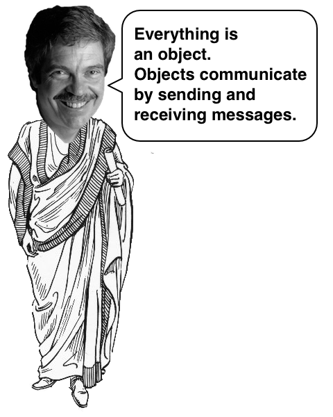
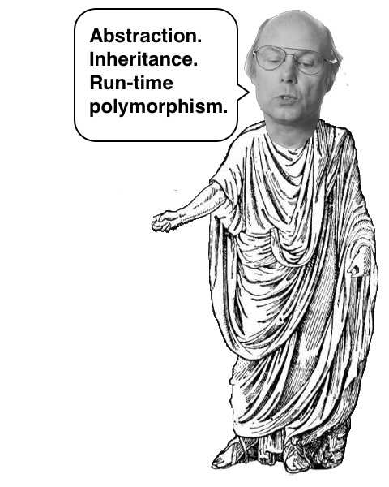
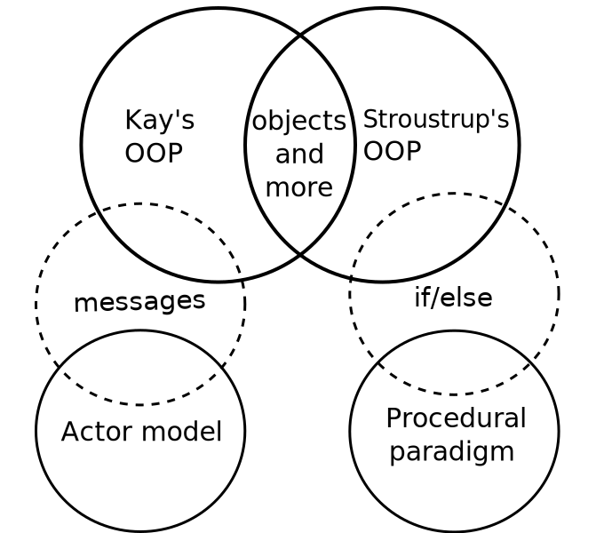

# 面向对象编程(OOP)的两大学派

> Author: Stereobooster / August 22, 2019

> Translator: [Angel_Kitty](https://github.com/AngelKitty)

没有一个人关于 OOP 有一个规范的定义，至少有两个人对此提出了他们的看法。从我的角度(**POV**)来看，有两个值得区分的大的定义，我作为最大的拥护者给它们命名。这两个定义有一些差异和共性。

我准备在互联网上讨论另一个关于 OOP 的争论。我决定对这个课题做一些研究。

我找到了[不止一个OOP的定义](http://c2.com/cgi/wiki?DefinitionsForOo)。有些定义是相同“调”的变体，有些是无用的。在我看来，这个领域有两个主要的思想方向，来自两个 OOP 的学派。学校就像在[思想学派](https://en.wikipedia.org/wiki/School_of_thought)。与[古希腊的哲学学派一样](https://en.wikipedia.org/wiki/Ancient_Greek_philosophy)，同样有两个 OOP 学校：

- Alan Kay 的学校或信息集中
- Bjarne Stroustrup的学校或班级以 [c2](http://c2.com/cgi/wiki?DefinitionsForOo) 为重点或 “PolymorphismEncapsulationInheritance”

**我必须强调，这篇文章并不是关于什么是 OOP 的最佳方式**，因为这样的讨论将导致圣战。相反，本文的目的是帮助认识到**有两种方法可以考虑OOP**。我相信这将有助于就 OOP 建立更具建设性的讨论。下次你将开始讨论OOP或 OOP vs，确保你知道你在谈论哪个 OOP 学派。

## 关于名字

我选择 Alan Kay 和 Bjarne Stroustrup 作为学派的创始人，因为他们是 OOP 的主要倡导者，也是每所学校的第一批 OOP 语言的作者。我知道有哪些编程语言是第一个 OOP 语言以及谁发明了 OOP，见历史部分。

### Kay 的学派

### Stroustrup 的学派

## 倡导者

[Alan Kay](https://en.wikipedia.org/wiki/Alan_Kay) 是 SmallTalk 的作者之一，[Sandi Metz](https://www.youtube.com/watch?v=29MAL8pJImQ) OOP 在 Ruby 世界中提倡。

[Bjarne Stroustrup](https://www.youtube.com/watch?v=JBjjnqG0BP8) 是 C ++ 的作者，[Grady Booch](https://en.wikiquote.org/wiki/Grady_Booch) 是 UML 的作者。

## 编程语言

SmallTalk，Ruby

C ++，Java

另请参阅：[C 语言系列：采访 Dennis Ritchie，Bjarne Stroustrup 和 James Gosling](http://www.gotw.ca/publications/c_family_interview.htm)

## 定义

> 1. 一切都是对象。
> 2. 对象通过发送和接收消息进行通信（就对象而言）。
> 3. 对象有自己的内存（就对象而言）。
> 4. 每个对象都是一个类的实例（必须是一个对象）。
> 5. 该类保存其实例的共享行为（以程序列表中的对象的形式）。
> 6. 为了求解程序列表的值，控制权被传递给第一个对象，剩余部分被视为其消息。
>
> [Smalltalk 的早期历史](http://worrydream.com/EarlyHistoryOfSmalltalk/)

> 这个定义源自 SmallTalk（SmallTalk-72？）的早期版本，规则 5 和 6 清楚地显示了 SmallTalk 的 Lisp 遗产。凯这样说，注意到规则 4-6 会随着 SmallTalk 的发展而变化。
>
> [Alan Kays 面向对象的定义](http://c2.com/cgi/wiki?AlanKaysDefinitionOfObjectOriented)

其他强调消息的注意事项：

> OOP 对我来说意味着只有消息传递，本地保留和保护以及隐藏状态进程，以及所有事物的极端后期绑定。它可以在 SmallTalk 和 LISP 中完成。可能还有其他可能的系统，但我不知道它们。
>
> [Alan Kay的深刻见解，2013年](http://mythz.servicestack.net/blog/2013/02/27/the-deep-insights-of-alan-kay/)

> 鉴于这些“面向对象”定义的一般标准，您可以找到几个看似合理的候选人，并且有几个社区有自己的定义。但是，我建议我们坚持在广泛的程序员社区中使用的面向对象的传统定义。语言或技术是面向对象的，当且仅当它直接支持：
>
> 1. 抽象 - 提供某种形式的类和对象。
> 2. 继承 - 提供从现有的抽象中构建新抽象的能力。
> 3. 运行时多态 - 提供某种形式的运行时绑定。
>
> [Bjarne Stroustrup，为什么 C ++ 不仅仅是一种面向对象的编程语言](http://www.stroustrup.com/oopsla.pdf)

另请参见：[什么是“面向对象编程”？（1991年修订版）](http://www.stroustrup.com/whatis.pdf)

## 什么是正确的定义？

这个问题仍然会出现，所以我觉得在圣战爆发前提出我的观点是正确的。

> Alan Kay 发明了术语“面向对象”，SmallTalk 早先出现，所以他的定义是“规范”，对吧？

简答：这是一个错误的问题。Alan Kay 创造了这个术语（我不喜欢在这种情况下“发明”这个词）和背后的理论。Stroustrup 使用相同的术语（也许不是他，也许是媒体大惊小怪，也许是无意中完成的）并给出了其他定义。没理由为此疯狂。发生了数百万次之前：

- [霍金的奇点](https://en.wikipedia.org/wiki/Penrose–Hawking_singularity_theorems) 术语被 [库兹威尔的奇点](https://en.wikipedia.org/wiki/Technological_singularity) 所掩盖。一些物理学家仍对此感到愤怒。
- [有些封面歌曲比原版更有名](http://www.huffingtonpost.com/2013/04/22/cover-songs-more-famous-than-originals-20-tunes_n_3118557.html)

到目前为止，有很多人跟随一所或另一所学校。所以说一些定义更好是**没有**多大意义，因为它是首先发明的或者有更多的追随者。我们能做的唯一合理的事情是给他们正确的名字，而不是互相混淆。

## 定义之间的差异

定义并不完全不同，他们只关注不同的事物。就像你问水果和蔬菜有什么区别一样，[答案取决于你问厨师或植物学家](http://www.livescience.com/33991-difference-fruits-vegetables.html)。

### 关于图表的说明

来自演员模型（actor model）的消息与 Kay 的 OOP 不同。但这两个概念都通过消息分享了沟通的想法。

在 Kay 的 OOP 中，可以在[没有内置 if-else 的情况下组织程序流](http://yehudakatz.com/2009/10/04/emulating-smalltalks-conditionals-in-ruby/)。在 Stroustrup 的 OOP 中它也是可能的，但它不是内置功能，所以大多数时候它与程序配对 `if-else`。

## OOP的历史

- 1963年 - Ivan Sutherland 的 Sketchpad 被认为是面向对象和 GUI 的开创性工作。
- 1967年 - Simula 出现了，它或者 SmallTalk 是否应该被认为是第一个面向对象的语言仍然是一个争论的问题。
- 1969年 - Dennis Ritchie 开始发展 C。
- 1972年 - 出现了 **SmallTalk**。这是 **Alan Kay** 的心血结晶，他创造的术语“面向对象”。
- 1979年 - **Bjarne Stroustrup** 开始使用 **C ++**（**C ++**的前身）开发 **C 语言**。
- 1983年 - Objective C 出现，基本上是努力将 SmallTalk 的面向对象的味道添加到 C。
- 1985年 - Object Pascal 出现，并且几乎立即被 Turbo Pascal 5.5 普及。
- 1986年 - CLOS 开始工作，努力将面向对象引入Common Lisp。
- 1991年 - Visual Basic 发布。
- 1995年 - Java 发布。
- 1995年 - Delphi 发布。

来源：[programmers.stackexchange.com](http://programmers.stackexchange.com/questions/173542/why-did-object-oriented-paradigms-take-so-long-to-go-mainstream)

## 其他说明

### Jonathan Rees 的定义

从我的角度(POV)[Jonathan Rees 的定义](http://paulgraham.com/reesoo.html)只是 Alan Kay 的变体。

### 图书

- [对象理论](http://lucacardelli.name/Topics/TheoryOfObjects/Contents.html)
- [每个程序员应该了解的面向对象设计](https://www.amazon.com/Every-Programmer-Should-Object-Oriented-Design/dp/0932633315)
- [面向对象的分析与应用设计](https://www.amazon.com/Object-Oriented-Analysis-Design-Applications-3rd/dp/020189551X)

## PS

对我来说，这种观点提供了一些见解，但同一时间开启了更多问题。

- [关于理解类型，数据抽象和多态](http://lucacardelli.name/Papers/OnUnderstanding.A4.pdf)，1985，[Luca Cardelli](http://lucacardelli.name/)，[Peter Wegner](http://cs.brown.edu/~pw/)
- [编程语言的基本概念](http://www.itu.dk/courses/BPRD/E2009/fundamental-1967.pdf)
- 继承作为代码重用的机制。那里有哪些不同类型的代码重用：基于类，基于原型，鸭子打字？
- 类型与类。另请参阅：[类型理论](http://c2.com/cgi/wiki?TypeTheory)，[ 类型和编程语言](http://www.cis.upenn.edu/~bcpierce/tapl/)，[了解类型](http://c2.com/cgi/wiki?OnUnderstandingTypes)
- [程序设计语言理论](http://c2.com/cgi/wiki?ProgrammingLanguageTheory)，[句法](https://www.youtube.com/watch?v=Nlqv6NtBXcA)
- 多态性的定义。
- 对象的定义。
- 晚期与早期结合。

未完待续…
