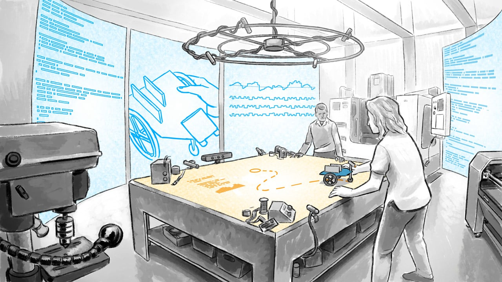

# Dynamicland, 可视空间和设计工坊

从 2017 年 9 月 11 日星期一开始 [Dynamicland](https://twitter.com/dynamicland1) 发布的一系列照片和视频剪辑让我意识到，我可能错过了一个有意思的东西 -- 并且我能够立即付诸行动 -- 那就是 Bret Victor 在 2014 年的分享 “可视空间”

下面是一些我尝试总结的片段。（如果你已经熟悉 Dynamicland，这将会有所帮助）

## 一个共享的知识空间

在 2013 年，Bret Victor 在[《关于道格拉斯·恩格尔巴特的一些话》](http://worrydream.com/Engelbart/)中批评了没有考虑格拉斯·恩格尔巴特《演示之母》真正意图的那些回顾。

从当今系统的角度来看 1968 年的演示，忽略了恩格尔巴特对 NSL 的定位，即从计算机程序员身上开始，作为增强人类智慧的工具。

## 最佳的可视化工具是房间

在 2014 年，Bret Victor 发表了[《可视空间》](http://worrydream.com/SeeingSpaces/)，以对话和漫画的形式阐述了“可视空间”的创意，它就像一个工坊或者创客空间，目的是为了帮助人理解而不是建造。

视频中的对话和漫画结尾都以描述了一个未来实验室而结尾，在这个实验室中到处都是巨大的屏幕，摄像头和分析仪器，帮助创造者们理解他们正在制作的机器人。

## 老套的文字描述

也是在 2014 年，Bret Victor 发表了 [《 老套的文字描述: 通过动态模型阐释和理解》](https://vimeo.com/114252897)，汇总了一系列（他自己和别人的）例子，这其中包括探索性解释、可交互文档和软件工具，使系统更加直观和易于理解。

## 关于工具

Bret Victor 在 2014 年有一个的谈话分享，我从中理解到：他说的是工具，当我们都认真地制造出最符合这种工作方式的工具时，一场革命就将到来。

在我上一个主要的个人项目中，我就是这样做的：我首先制作工具，使我能够全面、深入地理解我的工作。

## Dynamicland

几年之后，我的推特时间线被 Dynamicland 的参与者搞得有些混乱。我花了一分钟才明白我所看到的 Dynamicland，但如果你点击这条推特，就可以很好地理解 Dynamicland：

这个项目来自于 Bret Victor 所在的 Y Combinator HARC 实验室。Dynamicland 是一个允许通过实体对象和交互方式编程的工坊，整个房间就是程序员的 IDE。

但是,有另一条推特

我再引用一下这段话：

> _“把程序从屏幕里搬出来放到桌子上帮助我们互相学习”_。

那就不仅仅是把房间作为编程的工具

房间还是一个促进互相之间相互理解的编程工具。

我认为我错过了一些重要的东西。

## 设计工作室和参与式设计

在 2011 年，Will Evans 发表了一系列的文章，关于设计工作室、一个最初源于建筑的协作设计流程、工业设计、无关艺术评论。

- [设计工作室方法简介](https://web.archive.org/web/20111010221154/http://uxmag.com:80/articles/introduction-to-design-studio-methodology)
- [设计工作室的设计](https://web.archive.org/web/20111006040634/http://uxmag.com:80/articles/the-design-of-design-studio)
- [设计工作室和敏捷用户体验：过程和陷阱](https://web.archive.org/web/20111111004917/http://uxmag.com:80/articles/design-studio-and-agile-ux-process-and-pitfalls)
- [自 2011 年 5 月 2 日以来，Will Evans 发布的相簿](https://www.flickr.com/photos/27764576@N06/sets/72157626509819731/)

在像如[产品探索](http://jpattonassociates.com/design-studio-recipe/)的过程中，设计工作室方法用于促进参与式设计。

在工作室的整个过程中，所有的参与者都在同一个实体空间中工作，他们使用相同的工具，彼此之间共享知识。使用的工具是标记纸和便笺，为了促进彼此的理解。

## 也许不是工具的问题

Doug Engelbart 希望增强人类的智慧。他的论文[《增强人类智慧》](http://www.dougengelbart.org/pubs/augment-3906.html)没有探究通过其他人来增强智力，而是将 NSL 作为工具来增强，因为它支持广泛的协作。NSL 的参与者可以在相同的 _虚拟_ 空间内同时工作，使用相同的工具和共享知识。

**只有文字是过时的**是关于工具，但是正如 Bret Victor 在[《关于道格拉斯·恩格尔巴特的一些话》](http://worrydream.com/Engelbart/) 中批评到，这是“目前计算机单用户设计”的产物。这些是 Bret Victor 能展示给我们的唯一东西，因为这是我们所拥有的。

## 也许是为了促进共同理解

自从 2010 年以来，我一直在运营着设计工作室，我把那张图片和这个引述放到了一起。

> _“把程序从屏幕里搬出来放到桌子上帮助我们互相学习”_。

如果看到空间不仅仅是让一个*人*看到里面，看到时间，看到各种可能性的工具呢？

如果看见空间应该是让每一个人看到这些空间呢？你的所有同事，你的所有朋友，你所有参与者，都在同一个空间内，能够看到所有的数据和工具，获取共同的感悟？

这不是一个大房间吗？一堆人在里面吗？

如果我们可以看到未来的可视空间，一个小机器人和一两个创作者在一起，想想未来的工作坊是挤满了参与者，或者全是学生，所有人都希望去理解和贡献，也许你有一个理论来解释工坊的方法和参与式设计是如何扩展到工作的各个方面的。

设计工坊已经是一个用于描绘和迭代的可视空间：当你呈现和谈论每一个设计时你可以看到内部；你可以看到随着时间的推移每个迭代都建立在前一个迭代之上；你可以看到不同的可能性；

如果可视空间只是一个工具的话，那么我们只能在原地等待这个世界提供这样的工具。

但是如果可视空间包含了其他人或者便利性的话，那么我们我们不仅可以从工坊中获取过程和项目，并且可以用仪器探索它，把它们从显示器和服务器中拿出来放到桌子上变成有形的艺术品，我们还能够让人们参与进来。

一个可视空间也可以是非技术层面的，就像一个设计工作室，只要它有 3 种可视化属性。采访和汇报可以用来观察内部情况。语音和图像可以被记录下来和重播，记笔记和分析。场景规划可以帮助发现各种可能性。

可是空间也可以是技术层面的。我们可以用投影仪和笔记本电脑拼凑出针对个别问题的解决方案，就像 Dynamicland 一样创造编程的共享感知。

Dynamicland 的哪些方面是特定于编程的，哪些方面是可归纳的？

从学习将东西从垂直（私有显示、PowerPoint演示文稿）转到水平（共享工作台）是否足够？

那 3 种可视化属性是否满足，或者是否有其它的核心属性来促进共同感知？

在你自己的工作中，从何开始？

现在是 2017 年 9 月 12 日。感谢你的关注。

## 续

> *更新于 2017 年 10 月 1 日*

感谢所有的评论和转发。

同样感谢  Atlantic 文章 [《未来的软件天启日》](https://www.theatlantic.com/technology/archive/2017/09/saving-the-world-from-code/540393/)中的引用：

> 但看到他的谈话最终产生的影响，Bret Victor 大失所望。他后来说道“很多人似乎误解了我所说的话”。当人们开始邀请他参加会议讨论编程工具时，他就知道人们误会了他的意思。他说道“每个人都认为我对编程环境感兴趣”。事实上他对人们如何看见和理解系统感兴趣，正如他提到“动态行为的视觉表示”。

至少我并不孤单！
